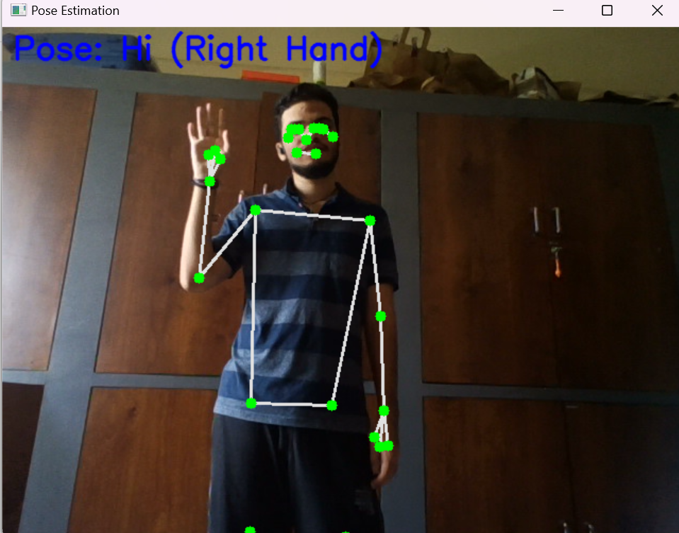

# Human-Pose-Estimation
Human Pose estimation using open cv (python)

# Abstract
Human pose estimation is a critical aspect of computer vision and machine learning, focusing on identifying and tracking the key points of the human body in images or video streams. This project employs Media Pipe, a versatile framework for building perception pipelines, and OpenCV, an open-source computer vision library, to implement real-time pose estimation. Utilizing Media Pipe's pre-trained pose detection model, the system can identify and track 33 key points on the human body, including joints such as elbows, shoulders, and knees. These key points are then connected to form a skeleton-like representation of the human figure, which can be used for various applications such as fitness tracking, gesture control, and augmented reality.

# OBJECTIVE
The project involves capturing video input from a webcam, processing each frame to detect human poses, and overlaying the detected key points and connections on the video feed in real-time. By converting each frame to RGB format and passing it through Media Pipe's pose detection model, the system accurately identifies pose landmarks, even in complex backgrounds. The detected landmarks are then drawn onto the frames using OpenCV, providing visual feedback of the pose estimation process. This real-time processing capability demonstrates the efficiency and robustness of Media Pipe's pose estimation model, highlighting its potential for integration into various interactive applications and human-computer interaction systems. The use of both OpenCV and Media Pipe showcases the power of combining different open-source tools to create advanced computer vision solutions

# Requirements

Python
OpenCV (cv2)
MediaPipe (mediapipe)
NumPy (numpy)
Webcam (for capturing real-time video)

# output

# conlcusion
In conclusion, the human pose estimation and detection project successfully developed and evaluated a robust system capable of real-time detection and tracking of key body joints from video input. The project showcased advancements in computer vision technologies, contributing to applications that require precise human pose analysis. Moving forward, continued research and development efforts will focus on enhancing system capabilities, addressing challenges, and exploring new applications to further advance the field of human-computer interaction and beyond.
